

<h1 style="font-size: 2.5em; font-weight: bold;">
  A comparative analysis of neural network architectures in TensorFlow and their impact on accuracy and computational efficiency in categorical image classification
</h1>

## How does the choice of neural network architecture from TensorFlow (Lightweight Models, Standard Models, Advanced Models) impact accuracy and computational efficiency in categorical image classification?

Subject: Computer Science

Candidate Code: mhr260

Word Count: 3976

Table of Contents

<a href="#h.qz1y5er6p8n6" class="c7">1. Introduction        3</a>

<a href="#h.usja8z7rstwy" class="c7">1.1 Concept        3</a>

<a href="#h.5ltz84tgecr6" class="c7">1.2 Purpose        10</a>

<a href="#h.ypqj1e4swcg4" class="c7">1.3 Research Question        11</a>

<a href="#h.bvwnowimg7jz" class="c7">2. Methodology        11</a>

<a href="#h.19vvc7xg1ezt" class="c7">2.1 Dataset        11</a>

<a href="#h.uu1ti0c748y2" class="c7">2.2 Model Selection        14</a>

<a href="#h.opzm411y7tpp" class="c7">2.3 Experimental Setup and Training
Strategy        16</a>

<a href="#h.qfjy39t3u5hu" class="c7">2.4 Evaluation
Metrics        17</a>

<a href="#h.qhu6xw779gr3" class="c7">3. Results and
Analysis        18</a>

<a href="#h.tmwhm69rtsat" class="c7">3.1 Raw Data        18</a>

<a href="#h.2p1qq5jq94ey" class="c7">3.2 Table        18</a>

<a href="#h.5bvqmx98m2ry" class="c7">3.3 Performance vs
Complex        19</a>

<a href="#h.it7phqm8duqv" class="c7">3.4  Model Complexity vs Inference
Speed        20</a>

<a href="#h.r20do8pcsdm" class="c7">3.5  Inference Speed vs
Accuracy        21</a>

<a href="#h.6kz23lo6mn4" class="c7">3.6  Accuracy vs Epoch
Comparison        23</a>

<a href="#h.hdn3yrskkcw" class="c7">3.7  Overfitting Assessment Between
Models (Loss and Accuracy Gap vs Epoch)        24</a>

<a href="#h.qkbxx55yp67h" class="c7">3.8  Training Cost vs Model
Size        26</a>

<a href="#h.kd8y9ldz5su2" class="c7">4. Conclusion        27</a>

<a href="#h.2eshscvx9p8d" class="c7">5. Limitations        28</a>

<a href="#h.1bsdo0adnffh" class="c7">6. Future Work and
Recommendations        30</a>

<a href="#h.pdae3xc569m6" class="c7">7. Work Cited        31</a>

<a href="#h.qr4tmow8pbgn" class="c7">8. Appendix</a><a href="#h.qr4tmow8pbgn" class="c7">        32</a>

# 1.        Introduction

Deep learning has become a
core component of modern artificial intelligence systems in computer
vision (Jainvidip). The core of this is convolutional neural networks
(CNNs). A class of neural networks designed for processing images that
are widely used for categorical image classification. It assigns a label
from a set of categories to a given image. However, as neural networks
become more powerful, the balance between model factors of accuracy and
computational efficiency is fundamental for real-world applications that
need both fast and low-powered performance on devices such as
smartphones or security cameras while maintaining accuracy for effective
use (Tan and Le). 

## 1.1        Concept

Convolutional Neural Networks (CNNs) are made out of a
specific neural network architecture that is mainly used and designed to
process visual data.

Convolutional Layers: 

In a CNN, convolutional layers are the foundation that
consist of kernels, which are small matrices that can detect specific
features in the image, for example, vertical or horizontal lines,
textures, and patterns by sliding them across
the image. These products are added up to produce a number that shows
the degree of presence of the specific feature in that region, which is
then placed into the activation function. Having more layers in an
architecture can enable the extraction of more subtle and complex
features, but too many layers can overfit and would redundantly increase
computational cost, which relates to the trade-off studied in this
research (Introduction
to Convolution Neural Network).

Activation Functions (ReLU):

These are non-linear functions and mathematical
operations that are applied to the output of the convolution operation,
transforming feature maps, resulting in activation maps. The
non-linearity enables the network to learn and model the inherent
complexity and patterns of real-world images. Other than non-linearity,
the ReLU function promotes sparsity, increasing computational efficiency
and accelerating the training process (Introduction to Convolution
Neural Network). 

Pooling Layers (Max Pooling): 

These layers systematically reduce the spatial
dimensions (height and width) of activation maps. Max pooling, the
common technique, reduces the computational demands and total number of
parameters in the network, helping the management of memory and
increasing training speed (Introduction to Convolution Neural Network).

Fully Connected Layers: 

These are the layers where the final pooling layer is
flattened (converted into a 1-dimensional vector). On this vector, a
weighted sum is performed, which is multiplied by its learned weight
coming from the convolutional layer, then summed up. Repeating this
process would assign weights to abstract features that will indicate a
specific class. These layers are intrinsic in parameters and heavily
affect the model size and computational cost; hence, an important factor
that reveals the trade-off (Introduction to Convolution Neural
Network).

Softmax Activation Function: 

The final step is where it converts these raw scores
into a probability distribution across the set of classes that allows
the model to make its final categorical prediction based on the highest
probability from it (Introduction to Convolution Neural Network).

These stacked layers’ complexity is the key source of
computational cost and model size that drives the trade-offs studied in
this research.

TensorFlow is widely recognized for its comprehensive
library of pre-trained convolutional neural network (CNNs) architectures
available (Introduction to TensorFlow). These models can be classified
into three categories, that shows different compositions of extraction
versus resource consumption related to the accuracy and computational
cost trade-off. These include:

1.  Lightweight Models: 

Architectures engineered for
efficiency and speed with fewer parameters and lower computational
demands, making them ideal for deployment on resource-constrained
devices (Introduction to TensorFlow). A model example is MobileNetV2.

1.  Standard Models: 

Balance between accuracy and
computational feasibility, with more parameters and computational
demands than lightweight models but less than advanced models, which is
suitable for mid-range computing platforms (Introduction to TensorFlow).
A model example is ResNet50.

1.  Advanced Models: 

The best possible accuracy with the least
computational burden and model complexity that makes ideal use of
maximum precision, like autonomous driving (Introduction to
TensorFlow). A model example is
EfficientNetB7.

These types of categorizations are designed to allow
for a comparison that can directly calculate the cost to obtain the
degree of accuracy that is analyzed in relation to the trade-off
discussed in this study.

The evaluation of CNNs requires an assessment of each
classification ability and resource needs. These are measures of the
trade-off.

- Training Accuracy: The model is learning from the
  dataset, which measures the model’s learning capacity, which ensures
  that the architecture can capture the features.
- Validation Accuracy: Identify if there is an over- or
  under-fitting. It monitors generalization with training, providing a
  necessary check of the model’s classification skills beyond memorized
  data.
- Test Accuracy: Means the model’s overall ability to
  correctly identify the 10 classes in CIFAR-10. It is the most reliable
  indicator of the model's performance in a real-world environment and
  gives an honest assessment of the model's performance in a real-world
  environment, using unseen data.
- Final Loss Value (Prediction Error): A numerical
  score obtained as a training measure for the model’s accuracy, and its
  magnitude indicates the accuracy of the prediction, helping reveal how
  close the model’s guesses are to the truth.
- Parameter Count (Model Size): This is the
  distinguishing feature in the three models, the size of the model that
  can be used for comparison of how efficient a model is at computing,
  and the amount of memory used.
- Inference Time: A measure of the speed at which a
  fully trained model can classify an image, and is a reliable measure
  of a model's computational efficiency since inference time is
  important to real-world processes used by applications. It is also
  vital to know if the classification ability of the model is fast
  enough for real-time tasks.
- Training Time: The cost of the model adoption is a
  useful measure of computational efficiency, in this case, resource
  demands, where it measures the computational investment and energy
  cost for the model to determine the reasonableness of the model’s
  logical construction.

These measures provide a quantitative basis for
objectively measuring and evaluating the difference between the
complexity of the model and performance.

Choosing the right dataset is key to reliable
comparative analysis in deep learning studies. Complex data sets can be
classified as follows:

- Real-World Datasets: 

High complexity with millions of large-scale images and
many small variations that are used to test model robustness in the real
world. ImageNet and COCO are both examples.

- Benchmark Datasets: 

Provides a simplified testing space for models through
small-scale images that only reveal sensitivity to data-level change in
modeling performance due to model architecture and not to noisy image
details. Isolated to provide information about the variable being
studied. For example, CIFAR-10. 

Thus, a benchmark dataset is selected to offer a
standardized basis from which to evaluate the trade-off between model
size and structure and thus ensure that all of the difference in both
sectors is caused by the architectural choice.

## 1.2        Research Gap

        While research has demonstrated peak accuracy
of the most advanced CNN architectures, there is a considerable gap in
the proportionality of the gains in accuracy to the computational cost
in benchmark environments. The majority of the studies are focused on
performance, which neglects the decreasing returns that are experienced
when implementing high-capacity models on small amounts of data. To
address this exclusion, this paper examines trade-offs for three
different TensorFlow architectures: Lightweight, Standard, and Advanced
models. Through a controlled benchmark environment, this approach
isolates it as the most vital variable that ensures performance is
clearly due to the difference between its architectural characteristics
and the dataset.

## 1.3        Purpose

To compare some selected convolutional neural network
architectures from Tensorflow, assessing performance versus resource
consumption of each model. To estimate and quantify the trade-offs for
each model, refinement is needed as per specific accuracy needs and
computational resources for applications in the real world.

## 1.4        Research Question

This study aims to address the following research
question: How does the choice of neural
network architecture from TensorFlow (Lightweight Models, Standard
Models, Advanced Models) impact accuracy and computational efficiency in
categorical image classification?

This is critical for deploying real-life AI models
because resources available for deployment rarely permit the use of the
most computationally expensive models; therefore, seeking to identify
the optimal model that provides the highest feasible accuracy while
maintaining a necessary level of efficiency and stability for practical,
scalable deployment.

# 2. Methodology

## 2.1 Dataset

The dataset chosen for each model is the CIFAR-10
dataset. Compared to others, its images are fixed and low-sized, which
provides a controlled experimental environment by neutralizing
data-specific variations, differences in model performance are reliably
attributed only to the architectural choices, not the model’s ability to
handle noisy image details. The dataset consists of 60,0000 32 by 32
pixel colored images divided into 10 distinct classes (University of
Toronto). 

- The manageable scale ensures efficient research in
  architectural trade-offs without demanding extreme computational
  resources. 
- CIFAR-10 is a widely recognized and studied dataset
  in the computer vision community, which ensures that the results are a
  reliable reference point to see model performance.

To preprocess the data:

1.  Load and combine the data by concatenating the
    entire loaded dataset into a single unified dataset for systematic
    partitioning
2.  All image values will be converted to the float32
    datatype and subjected to normalization by dividing them by 255,
    which scales the data into the range of 0 to 1 (Riva). This is
    essential as it prevents the activation function from being
    dominated by large input values.
3.  The integer labels representing the 10 classes were
    converted into a categorical format using one-hot encoding. It
    transforms the single integer representing the class into a
    length-10 binary vector because it is required during the softmax
    activation function for predicting probability distribution over 10
    classes, and prevents an ordered, numerical relationship between
    classes (One Hot Encoding in Machine Learning).
4.  A custom preprocessing step is required for the
    EfficientNetB7 Model because the minimum image input size is 48 x 48
    (Hugging Face). Therefore, the images trained in this model are
    resized.

To partition the data, two distinct sets of images
given from the dataset will be used, which are 50,000 images, the
official training set, and the 10,000 images, the official test set
(University of Toronto). Serves as a systematic division of data that
prevents common problems in modelling, such as overfitting, and allows
an effective, unbiased assessment of a model’s true performance,
ensuring the validity and comparability of experimental results.
Although it is an option to do the inherent 83 to 17 train test split by
CIFAR-10, I would like to add a validation split in the dataset. This
will make the dataset split into an 80% training set, a 10% validation
set, 10% test set. 

Training Set (80% of the dataset, 48,000
images)

- Used by the CNN architecture, adjusting its weights
  and parameters. 

Validation Set (10% of dataset, 6)

- Used to provide adjustments to hyperparameters
  (learning processes such as learning rates or batch size) to detect
  and prevent overfitting during training.
- Ensures that the performance measured by the test set
  is unbiased, preventing data leaking
- Test Set (10% of dataset, 6,000 images)
- This set provides a final unbiased evaluation of the
  fully trained and optimized model on unseen data.
- It is used to measure how well the model generalizes
  and its ability to apply learned patterns to new images.

.

## 2.2 Model Selection

To systematically investigate the trade-off between
accuracy and computational cost, three distinct architectures were
chosen to represent the spectrum of model complexity. These models,
lightweight, standard, and advanced, were chosen based on their status
as benchmarks in the industry. Therefore, it isolates the architectural
category as the primary variable for comparative analysis.

Lightweight Model: MobileNetV2

- The most prominent model that popularized the
  depthwise separable convolution (replacement of the convolution
  operation with much lighter operations).
- Represents the benchmark for computational efficiency
  and resource-constrained environments due to its large reduction of
  parameters and computational operations.
- Allows us to determine the maximum efficiency
  achievable for real-time deployment on low-spec devices. 

Standard Model: ResNet50

- Most commonly used benchmark model in the industry
  and research.
- Establishes a standard balance between performance
  and complexity.
- Trusted for high-accuracy tasks while having
  manageable computational demands.
- Represents high expected accuracy when a moderate
  investment in computational resources is made.

Advanced Model: EfficientNetB7

- An immense number of parameters
- Designed to push the limits of what a model could
  potentially learn through maximum possible feature extraction
  capability.
- Allows us to determine the maximum possible accuracy
  performance ceiling
- Determines if a marginal increase in feature
  extraction potential justifies the huge computational cost.

## 2.3 Experimental Setup and Training Strategy

For fair direct comparison, identical training regimens
must be conducted using the same set of hyperparameters, fine-tuning
strategy, and computational environment across all three models:

- All training was conducted on a Google Colab Virtual
  Machine, which includes a NVIDIA Tesla T4 GPU and 12 GB RAM, providing
  a standardized environment for performance measurement.
- All models and training operations will be managed
  using TensorFlow 2.x deep learning framework and its Keras API.
- To perform fine-tuning, unfreeze weights and layers
  of the pre–trained model and retrain them using the CIFAR-10 training
  set (Transfer Learning and
  Fine-tuning).
- 10 Epochs (number of cycles over the training set,
  suitable for observing performance in each cycle) will be used,
  allowing sufficient time for models to converge on the CIFAR-10
  classes while reducing overall computational time required.
- Batch size (number of data samples processed at one
  time before model’s parameters are updated) is 32, a standard size
  that balances two opposing factors, ensuring a stable estimate of the
  parameter and managing GPU memory consumption, maximizing training
  efficiency (How to Choose Batch Size and Number of Epochs When Fitting
  a Model?).
- The learning rate (a small value for fine-tuning to
  prevent rapid destabilization of existing weights) will be
  10-4, ensuring
  they adjust in very small increments to prevent destroying pre-trained
  features of the model (Monigatti). 

## 2.4 Evaluation Metrics

Three architectures will be compared by using the
metrics representing the performance and computational efficiency of
each model:

- Training Accuracy: Percentage of correct predictions
  calculated on the Training Set
- Validation Accuracy: Percentage of correct
  predictions calculated on the Validation Set after each epoch
- Test Accuracy: Percentage of correct predictions
  calculated on the Test Set
- Final Loss Value: Recorded from the model’s training
  history after the final epoch. 
- Parameter Count (Model Size): The exact numerical
  count of trainable weights and biases reported by the TensorFlow
  framework of the full architecture
- Inference Time: Average time taken by the model to
  perform a single prediction on an image from the test set. 
- Training Time: The total elapsed real time required
  for each model to complete all 10 epochs.

 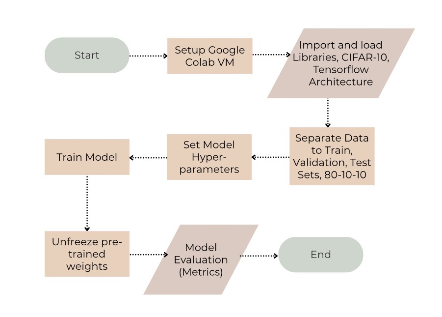

Figure 1. Methodology Flowchart

# 3. Results and Analysis

## 3.1 Raw Data

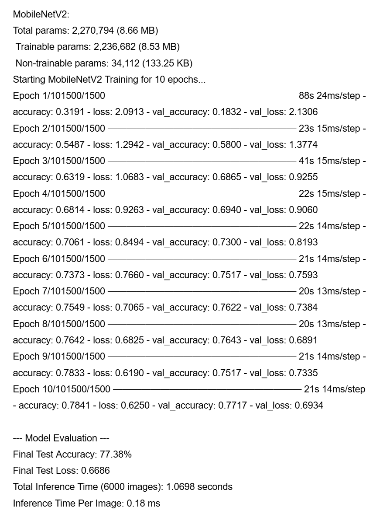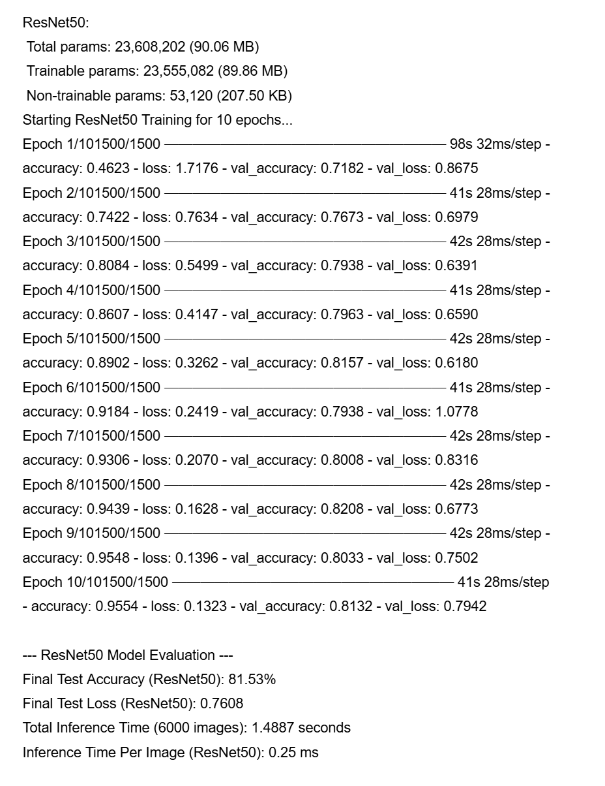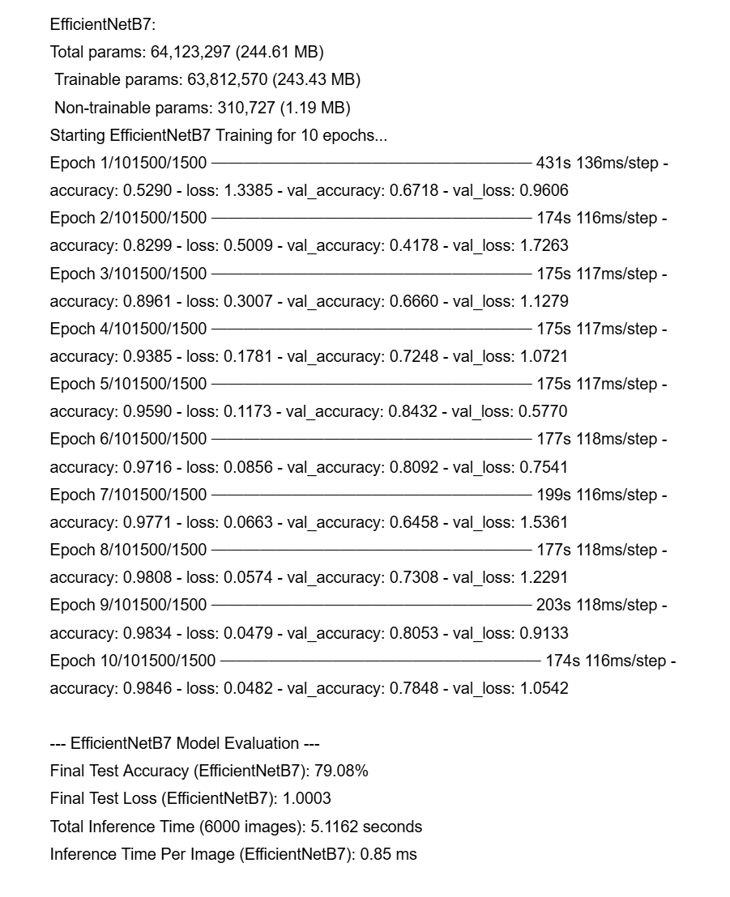

Figure 2. Raw Data
Results

## 3.2 Table

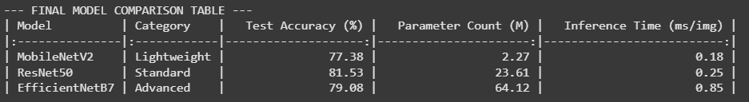

Figure 3. Table Results

In terms of efficiency, MobileNetV2, the lightweight
model, is best for computational efficiency. Its model size is
exceptionally small compared to the others, with the fastest inference
time per image, and offers the highest performance return per unit time
and size. Even with its small size and fast
inference speed, it achieves a comparable test accuracy of
77.38%. In terms of accuracy, the standard
model, ResNet50, has the highest test accuracy of 81.53% and represents
the optimal balance from the large increase in complexity and an
accuracy jump of 4.15% without a major increase in inference time. The
advanced model, EfficientNetB7, has steep diminishing returns and is not
computationally robust because its size and complexity are enormous,
being 30 times larger than MobileNetV2. It is 4 times slower than
ResNet50 inference time and has a disappointing test accuracy of 79.08%,
2.45% lower than ResNet50. 

## 3.3 Performance vs Complex

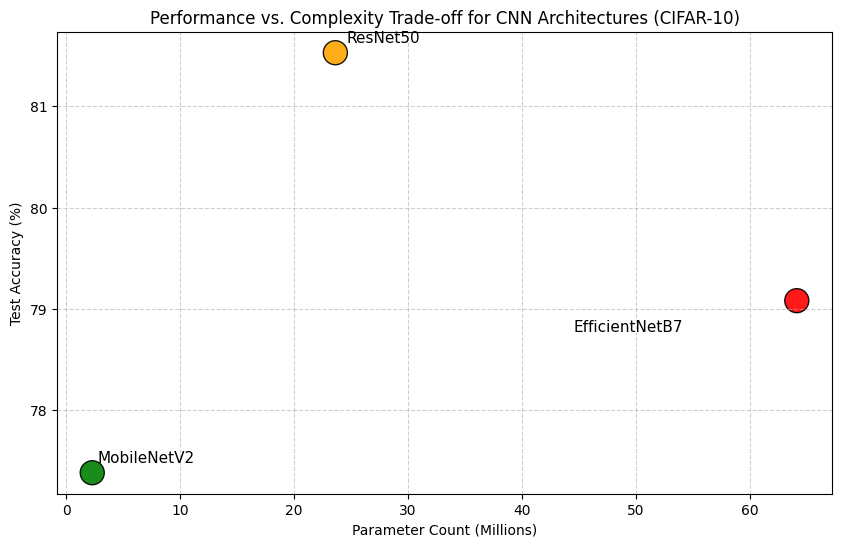

Figure 4. Performance vs Model Complexity Plot Between
Models

The plot shows that MobileNetV2 is efficient and
ResNet50 is optimal. This increase in complexity as well as accuracy
justifies the change in model complexity from lightweight to standard,
enabling the tradeoff between accuracy and efficiency. The advanced
model, EfficientNetB7, has the second-highest number of parameters, and
the accuracy of this model is lower than that of ResNet50, indicating
that the complexity and size of the model did not translate into higher
accuracy. This huge evolution of complexity was not functionally useful
to accuracy, but proves the claim that returns will reduce. This
suggests that there was a likely overfit, which means that performance
did not improve consistently during training.

## 3.4  Model Complexity vs Inference Speed

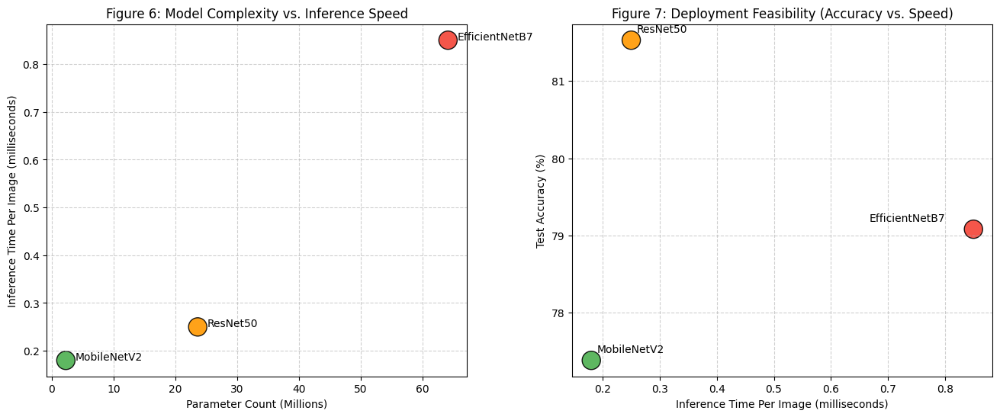

Figure 5. Model Complexity vs Inference Speed Plot
Between Models

This plot shows the relationship between model size or
complexity and its inference speed. The non-linear relationship is
directly exponential as the predicted period increases at a
disproportionately faster rate. MobileNetV2, the low-cost model, is
extremely efficient with the fewest parameters at 2.27 million and the
shortest inference time around 0.18 ms. ResNet50, representing the
standard model, has a larger size, 23.61 million parameters, with a
corresponding increase in inference time to 0.25 ms. The exponential
trend becomes evident with the advanced model, EfficientNetB7, which has
the largest size, 64.12 million parameters, with the slowest inference
time, 0.85ms. Hence, an increase in size will lead to a bigger increase
in inference time, showing the exponential time cost. 

## 3.5  Inference Speed vs Accuracy

Figure 6. Inference Speed vs Accuracy Plot Between
Models

MobileNetV2 provides the benchmark for computational
efficiency, achieving test accuracy 77.38% and the fastest inference
time of 0.18 ms, ideal for real-time processing on constrained resource
devices. The standard model, ResNet50, is shown to be the
best balance in terms
of performance and speed, with its high performance and a high test
accuracy, 81.53%, but a slightly slower justified inference speed
compared to MobileNetV2 of 0.25ms from its accuracy increase of 4.15%.
This makes it ideal for cloud-based applications where performance is
prioritized over low latency. However, the advanced model,
EfficientNetB7, exhibits a significant drop in efficiency, 0.85 ms
inference speed, four times slower than MobileNetV2, while having less
test accuracy, 79.08%, than ResNet50, showing that the advanced model
results in the worst performance per latency trade-off, the least
efficient model choice for practical deployment. 

## 3.6  Accuracy vs Epoch Comparison

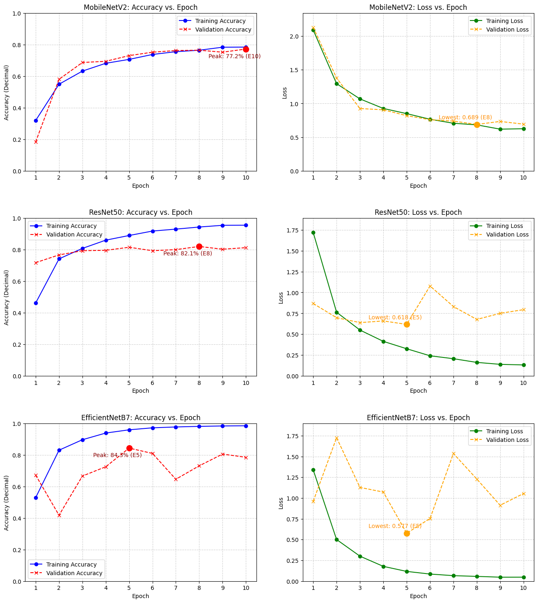

Figure 7. Accuracy vs Epoch Scatter Plot Comparison
Between Models

The plot for the lightweight model, MobileNetV2, shows
stable and consistent performance. As the training accuracy and
validation accuracy stay very close together throughout all epochs,
showing an optimal model fit. The plot for the standard model, ResNet50,
shows a moderate amount of overfitting since training accuracy increases
while validation accuracy does not show major improvements. The plot for
the advanced model, EfficientNetB7, shows severe overfitting because
training accuracy improves drastically while validation accuracy is
extremely unstable. Therefore, out of the three models, the lightweight
model, MobileNetV2, is most robust. 

## 3.7  Overfitting Assessment Between Models (Loss and Accuracy Gap vs Epoch)

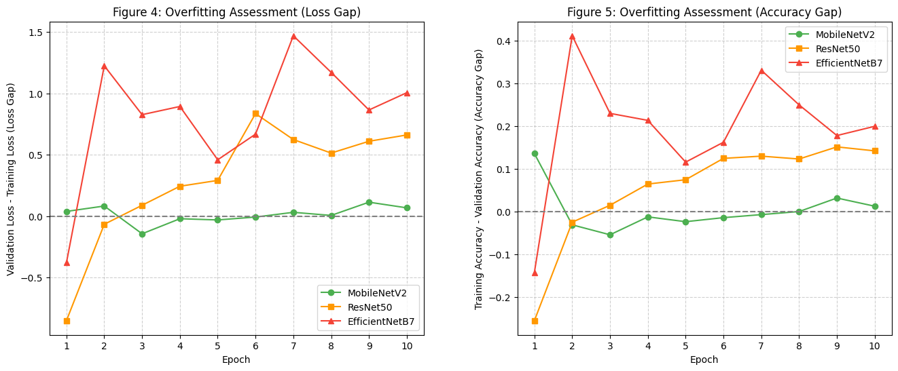

Figure 8. Loss and Accuracy Gap vs Epoch Between
Models

However, for both standard and advanced models, there
are clear signs of overfitting due to the standard model, ResNet50’s
moderate positive value in both plots, and a large positive value of the
advanced model, EfficientNetB7. Throughout the epochs, the standard
model ResNet50’s gap is much more stable than the advanced model and
follows a consistent trend into a bigger positive value and combining
with the analysis from the plot before, it stops extracting useful
features from the training data that would increase its accuracy on
validation data while the advanced model, EfficientNetB7 is extremely
unpredictable and inconsistent, suggesting a failure in learning process
as it doesn’t bother to extract generalizable features but memorizes the
training set causing a lot of inconsistencies when predicting the
validation set hence the unstable trend. In contrast to the standard and
advanced models, the lightweight model, MobileNetV2, has the smallest
positive gaps in both plots compared to the others; it is the most
robust and extracts the correct features in its parameters. 

## 3.8  Training Cost vs Model Size

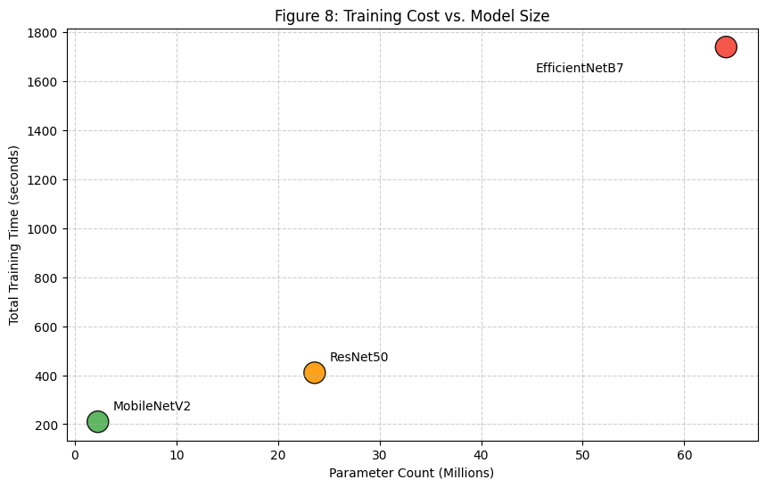

Figure 9. Training Cost vs Model Size Plot Between
Models

The trend is evident as MobileNetV2 requires the lowest
training time due to its small size, while the massive parameter count
of EfficientNetB7 results in the longest training duration. 

# 4. Conclusion

To conclude, the analysis indicates that the model's
performance is not uniform in terms of accuracy and computational
efficiency, and therefore, the model's use is subject to the specific
priorities of the application. The best test accuracy in the standard
model, ResNet50, was the maximum possible test accuracy, representing
the maximum performance ceiling. However, this performance comes with a
trade-off as the model shows a moderate level of overfitting.
Conversely, MobileNetV2 is the most computationally efficient,
maintaining a decent accuracy level with exceptionally low resource
requirements and inference time. This efficiency is further supported by
its robust learning behaviour, as it doesn’t overfit or underfit, making
use of the training data properly by extracting correct generalized
features.

 The advanced model, EfficientNetB7, is shown to be the
most redundant model. Despite its high complexity and model size, it
fails to achieve the highest accuracy with the slowest inference and
training time. It also shows extreme instability and unpredictable
overfitting, the model fails to properly extract generalizable and
correct features, and with its vast amount of parameters memorizes the
training data, leading to the consideration of too many variables that
don’t define the class, showing extreme computational inefficiency.

Therefore, when applications require the highest
possible accuracy, while having a moderate degree of overfitting,
achieved with the trade-off for having the best test accuracy, the
standard model, ResNet50, is the optimal choice. For applications with
speed, resource limitations, and reliable performance as critical
factors, the lightweight model, MobileNetV2, is optimal. 

Results of this study provide crucial evidence
regarding architectural optimization for constrained environments.

- Implications for Real-World Deployment: 

The success of MobileNetV2 is preferable for trends
involving efficiency. There are fields such as
autonomous drones, mobile healthcare diagnostics, or vast amounts of
satellite imagery analysis that are suitable because they prioritize
power consumption, memory footprint, and low
latency. For ResNet50,
its performance validates the use of high-capacity models in cloud
computing for companies, where computational resources are allowed and
encouraged to be maximized for optimal performance ceiling. 

- Implications for research: 

The failure of EfficientNetB7 highlights the concept of
diminishing returns through its mismatch in complexity with data
simplicity. This contributes to comprehending that increasing parameter
count doesn’t equate to improved generalization and can actually
introduce instability. Therefore, underscoring the need for model
complexity scaling to be proportional to the complexity of features in
the image dataset, to prevent observed overfitting.

# 5. Limitations

A significant limitation shown is the sole use of the
CIFAR-10 dataset to judge the three models. As such, its basic
characteristics provide an optimistic view of the efficiency of
MobileNetV2 while making it unsuitable for testing the full capacity of
the advanced model, EfficientNetB7. The CIFAR-10 dataset only contains
50,000 training images, an exceptionally small number for the advanced
model with a model size of 64 million parameters. The large capacity
allows the model to easily memorize both noise and specific features of
the class in every image in the dataset, leading to extreme overfitting
observed in training logs and a low test accuracy of 79.08%. Since the
dataset provides low-resolution images, which are 32 x 32 pixels, its
lack of intricate details inflates perceived efficiency for MobileNetV2,
as its simple architecture is sufficient for the basic features of the
small images. Consequently, the dataset’s simple features limit the
intrinsic learning complexity of the advanced architecture that obscures
its true performance ceiling and guides a misleading conclusion that the
model is redundant in performance. 

Secondly, the timing results are specific to the
consumer-level hardware utilized; using professional-level hardware
would likely reduce the training and inference times proportionally for
the advanced model, potentially altering the computational efficiency
rankings. 

Thirdly, the use of a standard set of hyperparameters
(batch size, learning rate, and number of epochs) directly contributes
to the moderate and extreme overfitting in ResNet50 and EfficientNetB7.
The diminished returns could be mitigated with targeted hyperparameter
tuning. 

Finally, the low sample size of architectures suggests
that the ideal trade-off conclusion is too narrow in its definition from
the models chosen and cannot be extended to all lightweight, standard,
or advanced variants.

# 6. Future Work and Recommendations

In order to overcome the limitation of the CIFAR-10
data, a new experiment can be conducted with more complex datasets that
fully use the capacity of advanced models such as EfficientNetB7.

In order to address the limitations of using the same
hardware, a study could use different GPUs in the Google Colab
environment, which might affect the computation efficiency
rankings.

To overcome the limitation of standard hyperparameters,
each model needs a large amount of hyperparameter tuning with specific
learning rates, batch sizes, and optimization algorithms. By locating
the right configuration for all models, their efficiency could increase
and naturally reduce overfitting.

Rather than using only three models for the categorical
levels of lightweight, standard, and advanced, there could be other
types of models available that would provide an understanding of how
model size affects accuracy and computational efficiency, and that might
therefore help more clearly differentiate between tradeoffs.

To further this research, testing the precision and
computational capabilities of each model to their desired use cases,
e.g., MobileNetV2 for drones, ResNet50 for industrial automation, and
EfficientNetB7 for satellite imagery analysis or medical imaging, would
also provide a context from which to assess the models themselves, but
also the properties of their preferred uses.

Works Cited

"CIFAR-10 and CIFAR-100
Datasets." Department of Computer Science,
University of Toronto,
www.cs.toronto.edu/~kriz/cifar.html. Accessed 14 Nov. 2025.

"How to Choose Batch Size and Number of Epochs When
Fitting a Model?"
GeeksforGeeks, 24
June 2025,
www.geeksforgeeks.org/machine-learning/how-to-choose-batch-size-and-number-of-epochs-when-fitting-a-model/.
Accessed 14 Nov. 2025.

"Introduction to Convolution Neural Network."
GeeksforGeeks, 11
July 2025, <a
href="https://www.google.com/url?q=http://www.geeksforgeeks.org/&amp;sa=D&amp;source=editors&amp;ust=1790656729088471&amp;usg=AOvVaw2t-7kCjIe91jcMS2m3j8XG"
class="c7">www.geeksforgeeks.org/</a> machine-learning/
introduction- convolution- neural-network/. Accessed 26 Sept.
2025.

"Introduction to TensorFlow."
GeeksforGeeks, 3
Jan. 2024, www.geeksforgeeks.org/introduction-to-tensorflow/. Accessed 2
June 2025.

"One Hot Encoding in Machine Learning."
GeeksforGeeks, 11
July 2025, www.geeksforgeeks.org/machine-learning/ml-one-hot-encoding/.
Accessed 14 Nov. 2025.

"EfficientNet." Hugging
Face – The AI Community Building the Future, 30
Feb. 2023, huggingface.co/transformers/model_doc/efficientnet.html.
Accessed 14 Nov. 2025.

Jainvidip. "Understanding Deep Learning: The Core of
Modern AI."
Medium, 5 July
2024, <a
href="https://www.google.com/url?q=http://medium.com/@jainvidip/understanding-&amp;sa=D&amp;source=editors&amp;ust=1790656729090211&amp;usg=AOvVaw1JJCm7FsdN8GuyyVt7CzbQ"
class="c7">medium.com/@jainvidip/understanding-</a> deep-
learning-the-core-of-modern-ai-bfe7b5fccdeb. Accessed 2 June
2025.

Monigatti, Leonie. "Intermediate Deep Learning with
Transfer Learning." Towards Data
Science, 22 Feb. 2023,
<a
href="https://www.google.com/url?q=http://towardsdatascience.com/&amp;sa=D&amp;source=editors&amp;ust=1790656729090908&amp;usg=AOvVaw1p8OT34gdeDk8THHiUYedv"
class="c7">towardsdatascience.com/</a> intermediate-deep-learning-with-transfer-learning-f1aba5a814f/.
Accessed 14 Nov. 2025.

Riva, Martin. "Batch Normalization in Convolutional
Neural Networks." Baeldung
CS, 18 Mar. 2024,
www.baeldung.com/cs/batch-normalization-cnn. Accessed 14 Nov.
2025.

Tan, Mingxing, and Quoc V. Le. "EfficientNet:
Rethinking Model Scaling for Convolutional Neural Networks."
ArXiv.org, 28 May
2019, arxiv.org/abs/1905.11946. Accessed 2 June 2025.

"Transfer Learning and Fine-tuning \| TensorFlow
Core." TensorFlow,
16 Aug. 2024, www.tensorflow.org/tutorials/images/transfer_learning.
Accessed 14 Nov. 2025.

# 8. Appendix

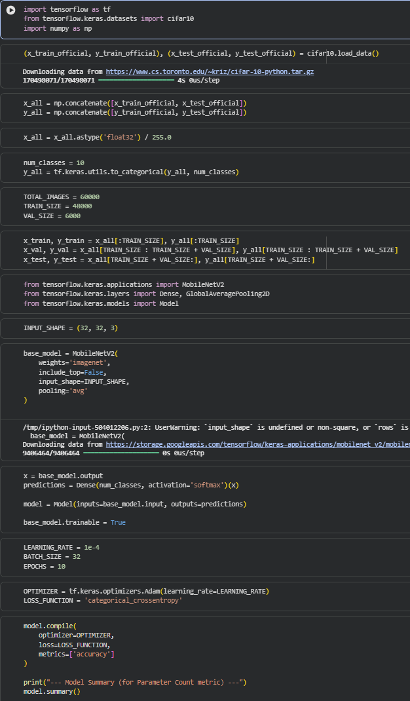

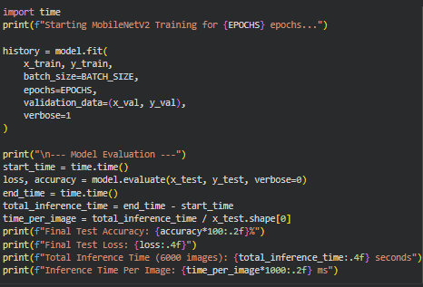

Appendix 1. MobileNetV2 Program

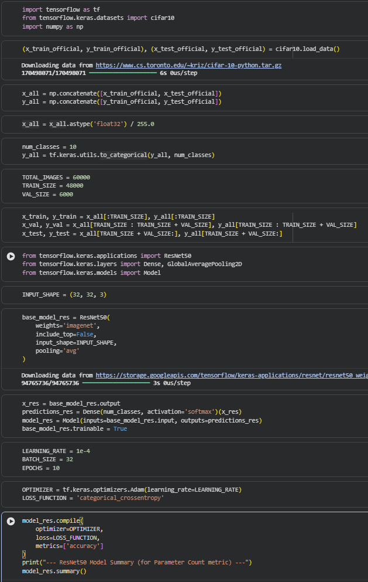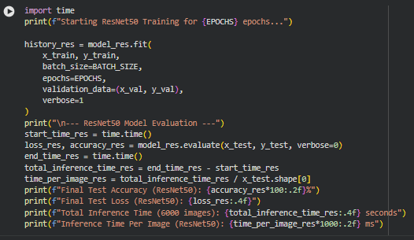

Appendix 2. ResNet50 Program

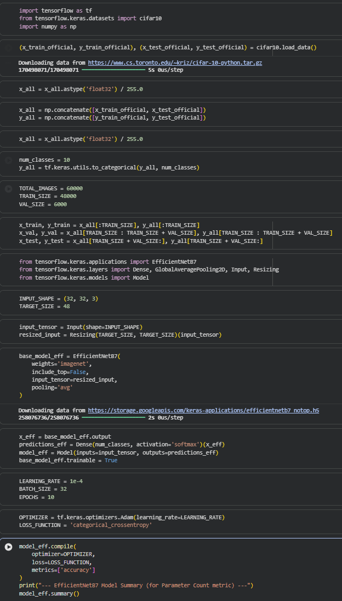

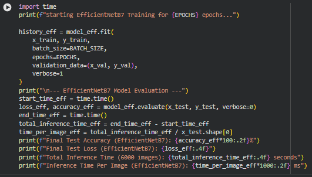

Appendix 3. EfficientNetB7 Program

